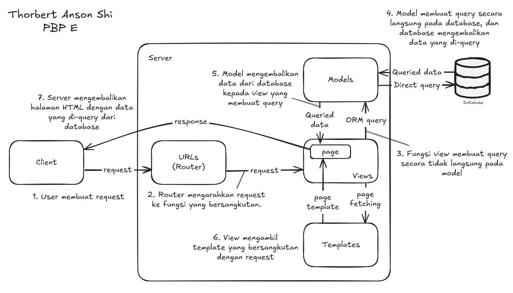
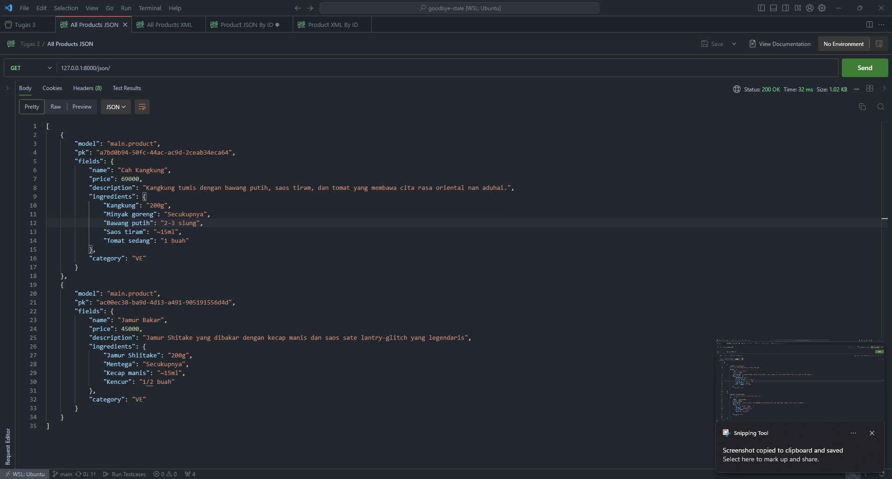
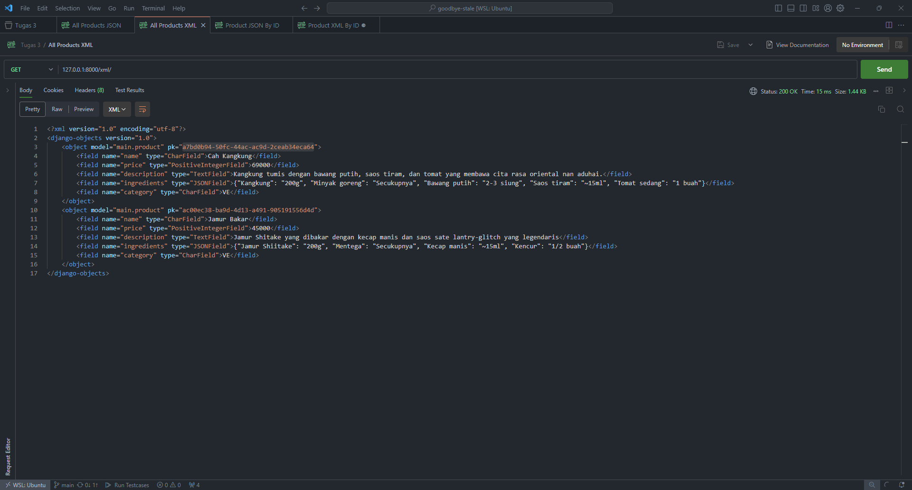
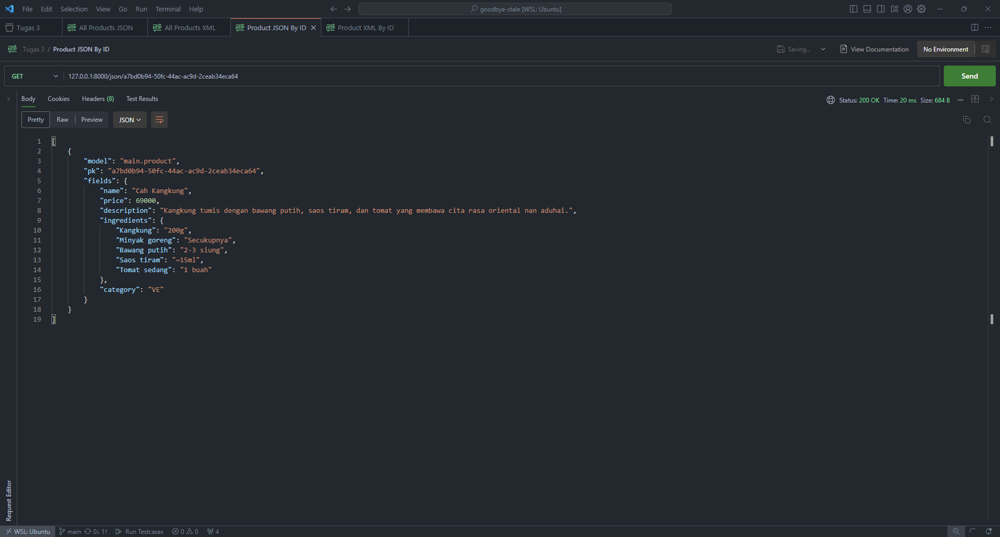
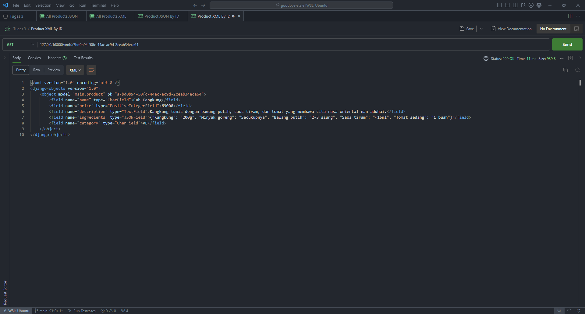

# goodbye-stale

## Tugas Individu 2 dan 3 untuk mata kuliah Pemrograman Berbasis Platform Semester Gasal 2024/2025

<hr>

Berikut tautan untuk

1. Link deployment PWS: http://thorbert-anson-goodbyestale.pbp.cs.ui.ac.id
2. Repo GitHub: https://github.com/thorbert-anson-shi/goodbye-stale

<hr>

## Tugas Individu 2

<h3>Jelaskan bagaimana cara kamu mengimplementasikan checklist di atas secara step-by-step (bukan hanya sekadar mengikuti tutorial).</h3>

### <u>Membuat sebuah proyek Django baru</u>

Pertama, saya membuat sebuah folder yang akan menampung _project_ Django saya dengan _command_ berikut:

```bash
mkdir goodbye-stale
cd goodbye-stale
```

Kemudian, saya menginisialisasikan suatu _repository_ Git yang kosong dengan _command_ berikut:

```bash
git init
```

Setelah membuat _repository_ di GitHub, saya menghubungkan _repository_ local saya dengan _repository_ remote tersebut dengan menjalankan _command_ <code>git remote add origin \<link ke repository\></code>

Lalu, saya membuat **_virtual environment_** supaya saya dapat mengunduh hanya _dependency_ yang dibutuhkan untuk _project_ ini. Hal ini saya lakukan dengan menjalankan _command_ berikut:

```bash
python -m venv env
```

Saya mengaktifkan **virtual environment** tersebut dengan menjalankan _command_ berikut:

```bash
source env/bin/activate
```

> Note: saya menggunakan Ubuntu on WSL, sehingga struktur **virtual environment** yang diciptakan berbeda dengan yang diciptakan menggunakan Windows.

Kemudian, saya menaruh semua _dependency_ yang saya butuhkan dalam suatu berkas bernama <code>requirements.txt</code>.

```
django
gunicorn
whitenoise
psycopg2-binary
requests
urllib3
```

Kemudian, saya mengunduh _dependency_ dalam <code>requirements.txt</code> dengan menjalankan _command_ berikut:

```bash
pip install -r requirements.txt
```

Untuk membuat project Django, saya menjalankan _command_ berikut pada terminal:

```bash
django-admin startproject goodbye-stale .
```

Pada titik ini, project <code>goodbye-stale</code> ini memiliki struktur berikut:

```
goodbye-stale/
    |- goodbye-stale/
    |    |- __init__.py
    |    |- asgi.py
    |    |- settings.py
    |    |- urls.py
    |    |- wsgi.py
    |
    |- manage.py
```

Folder <code>goodbye-stale</code> yang terletak di dalam folder utama menyimpan informasi mengenai pengaturan project, seperti host yang diperbolehkan untuk menjalankan _server_, _database_ yang digunakan, detail deployment project, dan URL dari semua aplikasi dalam project tersebut.

### <u>Membuat aplikasi dengan nama main pada proyek tersebut</u>

Saya membuat aplikasi bernama main dalam _project_ <code>goodbye-stale</code> menggunakan _command_ berikut:

```bash
django-admin startapp main
```

_Command_ ini membuat sebuah aplikasi bernama <code>main</code> dengan struktur berikut:

```
main
  |- migrations/
  |     |- __init__.py
  |- __init__.py
  |- admin.py
  |- apps.py
  |- models.py
  |- tests.py
  |- urls.py
  |- views.py
```

### <u>Melakukan routing pada proyek agar dapat menjalankan aplikasi main</u>

Pada berkas <code>settings.py</code> dalam folder <code>goodbye-stale</code>, saya menambahkan aplikasi <code>main</code> ke dalam daftar aplikasi <code>INSTALLED_APPS</code>.

```python
INSTALLED_APPS = [
    ...
    'main'
]
```

Menambahkan <code>main</code> ke daftar tersebut memberi tahu _project_ <code>goodbye-stale</code> bahwa terdapat sebuah aplikasi dengan nama <code>main</code> dalam _project_ tersebut.

### <u>Membuat model pada aplikasi main dengan nama Product dan memiliki atribut name, price, dan description</u>

Pada berkas <code>models.py</code>, saya menambahkan kode berikut untuk mendefinisikan properti dan atribut yang dimiliki oleh model Product dan model-model lain yang saya tambahkan.

```python
import uuid
from django.db import models

from django.contrib.auth.models import User

class Product(models.Model):
    class Category(models.TextChoices):
        CLASSIC = "CL"
        FRINGE = "FR"
        CARNIVORE = "CR"
        VEGAN = "VA"
        VEGETARIAN = "VE"

    name = models.CharField(max_length=128)
    price = models.IntegerField()
    description = models.TextField()
    ingredients = models.JSONField(default=dict)
    category = models.CharField(choices=Category.choices, null=True, max_length=2)
```

> Context: E-Commerce saya merupakan layanan yang menyediakan paket makanan bagi pembeli

Tipe data properti suatu objek didefinisikan dengan jenis _field_ pada models. Sebagai contoh, properti <code>price</code> memiliki tipe data <code>int</code> dan disimpan dalam _field_ <code>models.IntegerField()</code>, sementara <code>description</code> memiliki tipe data <code>str</code> dan disimpan dalam _field_ <code>models.TextField()</code>.

### <u>Membuat sebuah fungsi pada views.py untuk dikembalikan ke dalam sebuah template HTML yang menampilkan nama aplikasi serta nama dan kelas kamu</u>

Pada berkas <code>views.py</code>, saya menambahkan fungsi berikut yang mendefinisikan hal yang dilakukan saat pengguna membuat _request_ ke **_endpoint_** tertentu.

```python
from django.http import HttpRequest
from django.shortcuts import render
from .models import *

def all_recipes(request: HttpRequest):
    recipes = Product.objects.all()
    recipe_list = [recipe for recipe in recipes]

    return render(request, "main.html", {"recipes": recipe_list})
```

Apabila seorang user mengakses _endpoint_ yang memanggil fungsi <code>all*recipes()</code>, maka \_view* ini akan mengembalikan sebuah list berisikan semua _instance_ <code>Product</code> yang ada dalam _database_.

> Note: Secara default, sebuah _project_ Django akan dibangun dengan sebuah berkas _database_ bernama <code>db.sqlite3</code>.

_View_ ini mengembalikan data dalam bentuk laman web yang di-_render_ berdasarkan _template_ <code>main.html</code>. Kemudian, informasi dalam dictionary <code>{"recipes": recipe*list}</code> digunakan pada berkas \_template*.

Berkas <code>main.html</code> berisi HTML dengan beberapa kurung kurawal yang menandakan penggunaan data yang berasal dari _view_ yang bersangkutan.

Sebagai contoh, berikut sebagian dari kode <code>main.html</code> saya, dengan kode _styling_ yang telah dihapus:

```html
<main id="items-container">
  
  <div>
    <h1>{{item.name}}</h1>
    <h2>Rp {{item.price}}</h2>
  </div>
  <div>
    <div>
      <h2>Description</h2>
      <h2>{{item.description}}</h2>
    </div>
    <div>
      <h1>Ingredients</h1>
      <ul>
        
        <li>{{ingredient}}: {{quantity}}</li>
        
      </ul>
    </div>
  </div>
  
  <div>
    <h1>Goodbye::Stale</h1>
    <h1>
      We're cooking up something not stale! Please bear with us for a bit!
    </h1>
  </div>
  
</main>
```

> Bagian yang memiliki kurung kurawal berhubungan dengan informasi yang dikembalikan oleh _view_.

### <u>Membuat sebuah routing pada urls.py aplikasi main untuk memetakan fungsi yang telah dibuat pada views.py</u>

Untuk menghubungkan _endpoint_ yang saya inginkan dengan _view_ tertentu, dalam berkas <code>main/urls.py</code>, saya mendefinisikan suatu <code>list</code> bernama <code>urlpatterns</code> yang berisi seluruh _endpoint_ yang dimiliki oleh aplikasi <code>main</code>.

Berikut adalah sebagian dari isi berkas <code>urls.py</code> saya:

```python
from django.urls import path

from .views import *

urlpatterns = [
    path("", all_recipes, name="all_recipes")
]
```

Berkas ini menyatakan bahwa _view_ yang bernama <code>all*recipes</code> akan dijalankan apabila \_endpoint* <code>""</code> diakses.

Perhatikan juga bahwa terdapat berkas <code>urls.py</code> pada _folder_ <code>goodbye-stale</code>. Gabungan URL dari <code>goodbye-stale/urls.py</code> dan <code>main</code> digabungkan menjadi _endpoint_ keseluruhan yang diakses oleh pengguna.

Sebagai contoh, untuk berkas <code>goodbye-stale/urls.py</code> berikut:

```python
from django.contrib import admin
from django.urls import path, include

urlpatterns = [
    path('admin/', admin.site.urls),
    path('proj_path', include('main.urls'))
]
```

dan berkas <code>main/urls.py</code> berikut:

```python
from django.urls import path

from .views import *

urlpatterns = [
    path('app_path', all_recipes, name='all_recipes')
]
```

maka berikut adalah _endpoint_ yang akan menjalankan fungsi <code>all_recipes</code>:

```
https://<domain_name>/proj_path/app_path/
```

### <u>Melakukan deployment ke PWS terhadap aplikasi yang sudah dibuat sehingga nantinya dapat diakses oleh teman-temanmu melalui Internet</u>

Proses _deployment_ ke PWS cukup sederhana. Pertama, kita membuat berkas <code>.gitignore</code> untuk memastikan bahwa beberapa berkas seperti _folder_ <code>env/</code> tidak di-_push_ ke _deployment server_ PWS.

Isi <code>.gitignore</code> sesuai dengan yang dibuat pada [Tutorial 1](https://pbp-fasilkom-ui.github.io/ganjil-2025/docs/tutorial-0).

Setelah itu, saya memastikan bahwa berkas <code>requirements.txt</code> sudah terdapat pada _repository_ Git lokal yang akan di-_push_. Berkas ini akan digunakan untuk memberi tahu **server** _dependency_ apa yang dibutuhkan untuk membangun _project_ ini.

Saya juga memastikan bahwa pada berkas <code>settings.py</code>, URL deployment _project_ sudah ditambahkan pada daftar <code>ALLOWED_HOSTS</code>

```python
ALLOWED_HOSTS = ["thorbert-anson-goodbyestale.pbp.cs.ui.ac.id"]
```

Terakhir, saya mengikuti instruksi pada laman PWS dan menjalankan _command_ berikut pada terminal.

```bash
git remote add pws http://pbp.cs.ui.ac.id/thorbert.anson/goodbye-stale
git branch -M master
git push pws master
```

_Command_ ini mendorong _project_ <code>goodbye-stale</code> ke GitHub _server_ pada endpoint http://pbp.cs.ui.ac.id/thorbert/anson/goodbye-stale, dimana _project_ tersebut akan secara otomatis di-_deploy_ oleh _server_.

Setelah berhasil di-_build_, setiap orang yang memiliki akses ke Internet dapat mengakses laman web <code>goodbye-stale</code> dengan membuat _request_ ke URL laman.

<h3>Buatlah bagan yang berisi request client ke web aplikasi berbasis Django beserta responnya dan jelaskan pada bagan tersebut kaitan antara urls.py, views.py, models.py, dan berkas html.</h3>



<h3>Jelaskan fungsi git dalam pengembangan perangkat lunak!</h3>

**Git** merupakan aplikasi _source control_, yakni aplikasi yang dapat digunakan untuk mengatur dan mendokumentasikan pengembangan suatu perangkat lunak.

Salah satu fitur utama git adalah **_code branching_**, dimana suatu projek dapat memiliki banyak cabang yang memodifikasi aspek-aspek berbeda dari projek tersebut. Hal ini memungkinkan dua atau lebih _developer_ untuk bekerja sama dengan satu sama lain dengan adanya _server_ untuk _remote repository_, seperti GitHub dan GitLab.

Selain itu, Git juga menyediakan fitur-fitur yang mencegah terjadinya kesalahan pengguna dalam mengembangkan suatu projek. Sebagai contoh, Git dapat mendeteksi saat dua _branch_ yang berbeda membuat perubahan pada bagian kode yang sama, dan memberikan peringatan kepada _developer_ bahwa telah terjadi suatu **_merge conflict_** yang harus ditangani sang _developer_.

Git juga memiliki fitur _commit_, yang menyimpan kondisi sementara suatu projek. Apabila terjadi suatu _bug_ yang bersumber dari perubahan tertentu pada projek, _developer_ projek tersebut dapat menemukan dan mengembalikan projek ke kondisi sebelum _commit_ tersebut.

Kesimpulannya, Git sebagai aplikasi _source control_ dapat membantu _developer_ untuk bekerja dengan satu sama lain secara efektif dan efisien. Git dapat memfasilitasi pengembangan projek secara paralel antara dua atau lebih _developer_, dan meminimalisir terjadinya kesalahan dalam proses pengembangan projek tersebut.

### <u>Menurut Anda, dari semua framework yang ada, mengapa framework Django dijadikan permulaan pembelajaran pengembangan perangkat lunak?</u>

Menurut saya, Django adalah _framework_ pertama yang dipelajari pada mata kuliah PBP karena bahasa yang digunakan, yakni Python, merupakan bahasa pemrograman yang mudah dimengerti.

Kesederhanaan Python membantu kita sebagai mahasiswa untuk fokus ke konsep pengembangan perangkat lunak menggunakan framework, tanpa harus mempelajari _syntax_ dan bahasa pemrograman yang baru.

Selain itu, Django memiliki seperangkat fitur yang cukup matang dan memiliki dokumentasi yang baik, sehingga permasalahan dapat lebih mudah ditemukan dan di-_debug_ apabila aplikasi tidak berjalan sesuai dengan harapan.

### <u>Mengapa model pada Django disebut sebagai ORM?</u>

**_Object-relational mapping (ORM)_** adalah sebuah teknik pemrograman dimana data yang bersifat _relational_, seperti yang disimpan pada _database_, direpresentasikan sebagai objek yang dapat dimanipulasi dengan konsep _object oriented programming_.

Pada framework Django, **model** merupakan abstraksi dari skema dan _state_ dari _database_ yang digunakan. Kita dapat membuat _query_ ke _database_ menggunakan fungsi-fungsi tertentu yang dimiliki sebuah model.

Sebagai contoh, kita dapat membuat _query_ kepada model untuk mengembalikan semua objeknya, dengan fungsi berikut:

```python
<NamaModel>.objects.all()
```

Hal yang terjadi dalam penggunaan model seperti ini adalah:

1. Pengguna membuat query kepada model dengan bahasa Python
2. Model membuat query kepada database dengan bahasa native database

Dari proses interaksi antara pengguna dan data ini, kita dapat melihat bahwa pengguna tidak pernah membuat _query_ secara langsung kepada database. Pengguna hanya perlu berinteraksi dengan representasi objek yang diberikan oleh model, lalu model ini akan mengatur komunikasi antara server dan database.

## Tugas Individu 3

### <u>Jelaskan mengapa kita memerlukan data delivery dalam pengimplementasian sebuah platform?</u>

_Data delivery_ memungkinkan pengguna untuk mengakses dan berinteraksi dengan data yang bersifat dinamis, yakni data yang dapat berubah dan dapat datang dalam berbagai bentuk (teks, gambar, audio, dll.). Keberadaan data delivery dapat mengubah webpage yang sebelumnya hanya berisi data statis dan _hard-coded_, menjadi webpage yang dapat merefleksikan perubahan-perubahan yang terjadi pada server.

### <u>Menurutmu, mana yang lebih baik antara XML dan JSON? Mengapa JSON lebih populer dibandingkan XML?</u>

Menurut saya, kedua JSON dan XML memiliki kelebihan dan kekurangan pada bidang tertentu. Salah satu kelebihan JSON adalah performa saat melakukan parsing.

Hal ini dikarenakan struktur JSON yang sederhana memungkinkannya untuk diterjemahkan secara langsung menjadi object dalam JavaScript (dan beberapa bahasa pemrograman lainnya).

XML memiliki kemampuan validasi data yang lebih baik dibandingkan JSON, dikarenakan adanya DTD (Document Type Definition) dan XSD (XML schema) untuk validasi data XML, dibandingkan dengan JSON yang memerlukan library third-party untuk melakukan validasi data.

Menurut saya JSON lebih populer daripada XML dikarenakan representasinya yang lebih familiar, yakni key-value pair yang dapat ditemui dalam berbagai bahasa pemrograman seperti JavaScript dan Python.

### <u>Jelaskan fungsi dari method <code>is_valid()</code> pada form Django dan mengapa kita membutuhkan method tersebut?</u>

Method <code>is_valid()</code> memeriksa masukan pengguna dan memastikan bahwa masukan tersebut sesuai dengan skema yang sudah ditentukan untuk form tersebut. Sebagai contoh, apabila dalam suatu form, <code>field_a</code> didefinisikan sebagai <code>forms.CharField(max_length=20)</code>, maka method <code>is_valid()</code> akan memeriksa masukan pengguna untuk <code>field_a</code> dan memastikan kalau panjangnya tidak lebih dari 20.

Dalam konteks <code>ModelForm</code>, apabila terdapat salah satu bagian dari input data pengguna yang tidak tepat, <code>form.is_valid()</code> akan mengembalikan <code>False</code> dan mencegah pembuatan instance model yang baru dari data masukan tersebut.

### <u>Mengapa kita membutuhkan csrf_token saat membuat form di Django? Apa yang dapat terjadi jika kita tidak menambahkan csrf_token pada form Django? Bagaimana hal tersebut dapat dimanfaatkan oleh penyerang?</u>

Cross-site Request Forgery merupakan sejenis serangan siber yang melibatkan seorang penyerang menggunakan kredensial yang diberikan oleh pengguna lewat cookie atau authentication token. Dengan _social engineering_, penyerang dapat membuat pengguna mengakses laman yang terinfeksi. Laman ini memiliki kemampuan untuk membuat request ke _target_ website yang ingin dikunjungi pengguna. Dengan mendapatkan informasi autentikasi yang didapatkan, penyerang mendapatkan akses kepada akun pengguna dan dapat melakukan hal-hal yang merugikan korban.

Token CSRF (yang lebih mudah diingat sebagai token anti-CSRF) mencegah serangan CSRF dengan membuat sebuah bilangan acak yang perlu dikirim bersama dengan form yang dikumpulkan. Bilangan acak ini dibuat oleh server dan diberikan kepada pengguna lewat cookie atau hidden field dari sebuah form. Agar form dianggap valid, pengguna harus mengumpulkan form tersebut beserta dengan token anti-CSRF, supaya server dapat memvalidasi bahwa form yang dikumpulkan pengguna merupakan form yang diberikan server.

Apabila kita tidak menggunakan <code>csrf_token</code> pada form Django, maka Django tidak akan menerima pengumpulan form yang bersangkutan dengan message 'Forbidden: CSRF verification failed. Request aborted.'

### <u>Jelaskan bagaimana cara kamu mengimplementasikan checklist di atas secara step-by-step</u>

Pertama, saya membuat sebuah class <code>ProductCreationForm</code> yang meng-_inherit_ dari <code>django.forms.ModelForm</code>.

```python
class ProductCreationForm(forms.ModelForm):
    class Meta:
        model = Product
        fields = ["name", "price", "description", "ingredients", "category"]
```

Lalu, saya membuat view yang me-_render_ object form <code>ProductCreationForm</code> pada suatu template baru yang saya namakan <code>product-creation.html</code>.

```python
def create_product(request: HttpRequest):
    form = ProductCreationForm(request.POST or None)

    if form.is_valid() and request.method == "POST":
        form.save()
        return redirect("all_recipes")

    return render(request, "product-creation.html", {"form": form})
```

> <code>return redirect("all*recipes")</code> membawa pengguna kembali ke \_homepage* setelah selesai mengisi form.

Isi <code>product-creation.html</code> adalah sebagai berikut:

```html
 
<h1>Create a product</h1>
<form method="post">
   {{ form }}
  <button type="submit">Confirm</button>
</form>

```

> Note: jangan lupa untuk menambahkan <code></code> untuk mencegah terjadinya serangan CSRF lewat form yang dibuat.

Setelah membuat view dan template yang diperlukan, saya menghubungkan view ini dengan URL yang digunakan sebagai endpoint bagi pengguna untuk mengisi form pembuatan <code>Product</code>:

```python
path("create_product/", create_product, name="create_product"),
```

Terakhir, saya membuat 4 view untuk melakukan fetching data dari server dalam bentuk JSON dan XML:

```python
# fetch all products in json
def fetch_products_json(request: HttpRequest):
    queryset = Product.objects.all()
    return HttpResponse(
        serializers.serialize("json", queryset), content_type="application/json"
    )


# fetch all products in xml
def fetch_products_xml(request: HttpRequest):
    queryset = Product.objects.all()
    return HttpResponse(
        serializers.serialize("xml", queryset), content_type="application/xml"
    )


# fetch product json by id
def fetch_product_json_by_id(request: HttpRequest, id: uuid.UUID):
    queryset = Product.objects.filter(pk=id)
    return HttpResponse(
        serializers.serialize("json", queryset), content_type="application/json"
    )


# fetch product xml by id
def fetch_product_xml_by_id(request: HttpRequest, id: uuid.UUID):
    queryset = Product.objects.filter(id=id)
    return HttpResponse(
        serializers.serialize("xml", queryset), content_type="application/xml"
    )
```

Terakhir, setiap view yang saya buat pada langkah ini dihubungkan dengan URL yang bersangkutan dengan menambahkan kode berikut pada berkas <code>main/urls.py</code>:

```python
urlpatterns = [
    ...
    path("json/", fetch_products_json, name="fetch_products_json"),
    path("xml/", fetch_products_xml, name="fetch_products_xml"),
    path("json/<str:id>/", fetch_product_json_by_id, name="fetch_product_json_by_id"),
    path("xml/<str:id>/", fetch_product_xml_by_id, name="fetch_product_xml_by_id"),
]
```

### <u>Mengakses keempat URL di poin 2 menggunakan Postman, membuat screenshot dari hasil akses URL pada Postman, dan menambahkannya ke dalam README.md</u>

<p>GET semua object dalam bentuk JSON</p>

<p>GET semua object dalam bentuk XML</p>

<p>GET object by ID dalam bentuk JSON</p>

<p>GET object by ID dalam bentuk XML</p>


## Tugas Individu 4

### <u>Apa perbedaan antara <code>HttpResponseRedirect()</code> dan <code>redirect()</code>?</u>

<code>HttpResponseRedirect</code> merupakan suatu class HTTP Response yang disediakan oleh Django untuk merepresentasikan response dari server yang membawa (_redirect_) pengguna ke halaman yang berbeda. Dalam implementasinya, kita dapat membuat sebuah _object_ <code>HttpResponseRedirect</code> lalu mengembalikannya pada suatu view seperti berikut:

```python
from django.http import HttpRequest, HttpResponseRedirect

def my_view(request: HttpRequest):
    # kode lain
    # ...
    return HttpResponseRedirect('/url/yang/dituju/')
```

Sedangkan, fungsi <code>redirect()</code> yang disediakan oleh Django merupakan convenience function yang juga melakukan redirect terhadap pengguna. Namun, ia juga menerima argumen lain selain URL yang dituju, seperti nama view yang bersangkutan, atau saat URL yang dituju bersifat dinamis dan memiliki parameter yang dapat berubah.

```python
from django.http import HttpRequest
from django.shortcuts import redirect

def my_view(request: HttpRequest):
    # kode lain
    # ...
    return redirect('nama view')

    # atau

def my_view(request: HttpRequest):
    # kode lain
    # ...
    return redirect('url/yang/dituju/')
```

Kesimpulannya, <code>HttpResponseRedirect</code> dan <code>redirect()</code> berperan untuk melakukan redirect, namun fungsi redirect cenderung lebih fleksibel dibandingkan dengan <code>HttpResponseRedirect</code>.

Namun, harus kita perhatikan bahwa fungsi <code>redirect</code> langsung melakukan redirect saat fungsinya dipanggil, sedangkan memanggil konstruktor <code>HttpResponseRedirect</code> tidak langsung mengembalikan _response_ ke pengguna. Oleh karena itu, apabila kita perlu memodifikasi isi dari response sebelum melakukan _redirect_, pembuatan objek <code>HttpResponseRedirect</code> lebih tepat digunakan.
